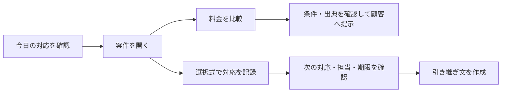
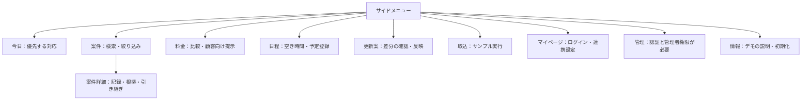
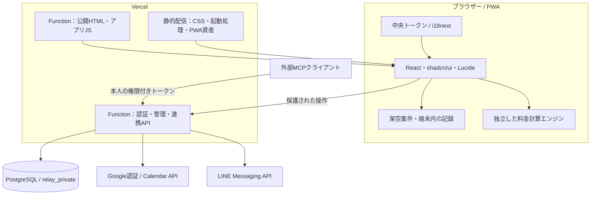
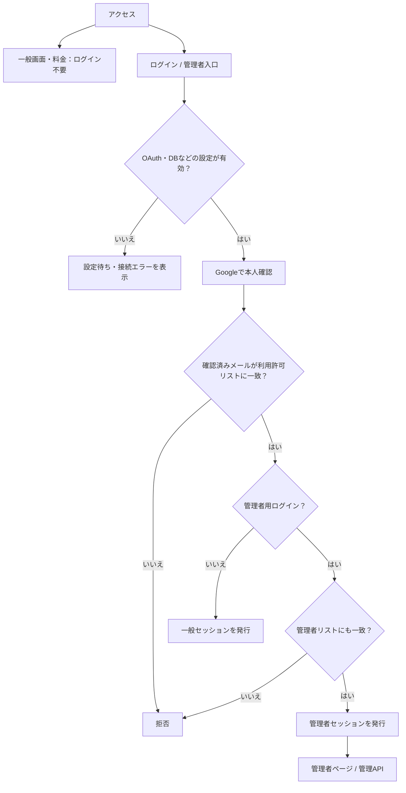
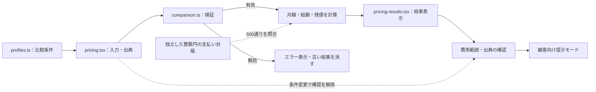
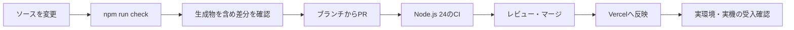

# Relay

**案件の状況を把握し、提案・対応・引き継ぎへ進むための業務アプリ。**

営業担当者が顧客の前で使える料金シミュレーターと、日々の案件管理を一つにまとめています。営業から事務・運用・顧客サポートまで、入力を増やさずに仕事を進められる基盤を目指します。

[公開デモ](https://relay-chi-ecru.vercel.app/) · [管理者入口](https://relay-chi-ecru.vercel.app/admin?lang=ja) · [開発ルール](AGENTS.md) · [デザインガイド](docs/DESIGN_GUIDELINES.md)

> 一般画面・料金シミュレーターはログインなしで利用できます。案件は架空データです。管理情報や外部連携は認証で保護し、実サービスの利用には別途設定・動作確認が必要です。

## まず試す

公開デモを開き、サイドメニューから「今日」「案件」「料金」の順に操作すると全体を確認できます。



返答待ち・相手の了承だけではタスクを完了にしません。完了結果と完了保存を明示的に選ぶ設計です。

## 画面の見取り図

ページ移動と主要機能は左サイドメニューへ集約しています。料金・日程はダイアログ、案件詳細は専用画面です。



| 機能 | 現在できること | 利用範囲・残っていること |
|---|---|---|
| 案件・対応記録 | 一覧、詳細、選択式記録、完了、引き継ぎ | 架空データ。案件のサーバー同期は未実装 |
| 料金シミュレーター | 月額・総額・残債の比較、出典確認、顧客向け提示 | 税込JPY・一定月額モデル。試算保存・共有リンクは未実装 |
| 更新案・取込 | サンプルの差分確認と反映 | 実ファイル取込・会話からの自動抽出・LLM接続は未実装 |
| Google認証・管理 | 許可リスト、管理者限定ページ、セッション・設定状況の確認 | OAuth・DB設定と実ログイン確認が必要。権限編集は環境変数で実施 |
| LINE | 個人・グループの通知先連携、固定のテスト通知 | Messaging API設定が必要。期限の自動通知は未実装 |
| カレンダー・MCP | 空き時間候補、予定登録、同じ日程機能のMCP公開 | Googleの追加同意・暗号化設定等が必要。任意のMCPへ接続するクライアントではない |
| 端末・言語 | レスポンシブUI、PWA、日英文言・地域書式・RTL | 全言語を翻訳済みではない。実機での受入確認は未完了 |

## 顧客データの蓄積（設計済み・未実装）

[CRMデータベース設計](docs/CRM_DATABASE.md)では、顧客を中心に連絡先・複数案件・活動・タスク・料金提案を保存する14テーブルを定義しています。所属ごとの隔離、変更履歴、競合・再送対策を含みます。[設計用SQL](docs/database/crm-draft.sql)は本番マイグレーションとは分離しており、現在の公開デモに実顧客の保存機能はまだありません。

## 全体構成

現在は **React + TypeScript + Tailwind CSS + Vercel Functions**。Next.jsは導入していません。案件の端末内保存と、認証・外部連携のサーバー保存を分けています。



PostgreSQLはNeonまたはSupabaseの接続を想定しています。ブラウザーからDBへ直接接続せず、APIが権限を検証します。LINE Webhookは署名、MCPはBearerトークンを検証し、それぞれの経路で本人・通知先・操作権限を確認します。

| データ | 保存場所 | 境界 |
|---|---|---|
| 未ログインのデモ記録・下書き | `sessionStorage` | タブ内のデモ。認証済みの下書きを読み込まない |
| 認証済みのデモ記録・下書き | `localStorage` | 端末内のサンプル保存。サーバー同期や本番案件DBではない |
| 料金入力・出典・計算結果 | メモリー | ダイアログを閉じると破棄。サーバーへ送らない |
| 認証セッション・通知先・日程候補 | サーバーのPostgreSQL | APIで認証・所有権を検証 |
| カレンダーの接続トークン | サーバー側で暗号化して保存 | ブラウザーやMCPクライアントへ配布しない |

## Googleログインと管理者の境界

一般画面を公開しても、管理者権限は公開しません。**Googleによる本人確認と、Relayの許可リストによる権限確認は別の判定**です。



- `ALLOWED_GOOGLE_EMAILS`：ログインできるアカウント。
- `ADMIN_GOOGLE_EMAILS`：その中で管理者権限を持つアカウント。未設定では管理者を付与しません。
- 保護されたページ・APIでは現在のセッション、許可リスト、期限を再確認します。URLや画面の表示フラグは権限の根拠にしません。
- 管理者画面はアカウント・権限・セッション数・設定状況の確認用。画面からアカウントを追加・昇格させる機能はありません。

設定・例外状態・実ログインの確認手順は[管理者ページ](docs/ADMIN.md)と[Google認証・LINE通知](docs/AUTH_LINE.md)を参照してください。

## 料金計算を画面から分離する

計算はTypeScriptの純粋関数に集約し、UI・DOM・DBへ依存させません。`decimal.js`で計算し、金額を十進文字列で返します。表示は`BigInt`と`Intl`を使用します。



**架空の計算例**：導入前20,000円/月、導入後8,000円/月、初期費用100,000円、分割5,000円/月 × 60回。

| 比較期間 | 導入前総額 | 導入後総額 | 総額の変化 | 期間後の残債 |
|---|---:|---:|---:|---:|
| 120か月 | 2,400,000円 | 1,360,000円 | 1,040,000円減 | 0円 |
| 12か月 | 240,000円 | 256,000円 | 16,000円増 | 240,000円 |

月額が下がっても総額が増える場合があるため、月額・総額・残債を分けて提示します。補助金、変動金利、融資返済表などは未対応です。計算テストは計算契約への適合を確認するもので、入力された価格や販売条件の正当性を保証しません。[計算式・適用範囲・検証例](docs/PRICING.md)

## LINE・カレンダー・MCP

LINEはログイン手段ではなく通知先として連携します。カレンダーは本人の空き時間から候補を作り、選択後に再確認して登録します。いずれも、会話を読み取って自動送信する機能ではありません。

```mermaid
flowchart TB
    subgraph lineFlow["LINE：本人の通知先を確定"]
        code["Relayで連携コード発行"] --> chat["本人がLINEへコード送信"]
        chat --> verify["Webhook署名・コード・所有権を検証"]
        verify --> approve["Relay画面で通知先を確定"]
        approve --> send["明示操作で固定テスト通知"]
    end
    subgraph calendarFlow["カレンダー：候補と登録を分離"]
        consent["Googleの追加権限に同意"] --> freebusy["本人の空き時間を取得"]
        freebusy --> proposal["期限付きの日程候補を保存"]
        proposal --> choose["候補を選択して登録要求"]
        choose --> recheck["所有権・期限・空きを再確認"]
        recheck --> event["本人のカレンダーへ登録"]
    end
```



MCPは**Relayがサーバーになる**構成です。`/api/mcp`で同じ日程機能を公開し、`read`は照会のみ、`book`は候補作成・登録も許可します。外部クライアントが登録を呼び出す場合も、本人の候補所有権と空き時間の再確認を通します。招待メールやLINE通知は予定登録に連動して送信しません。

接続・再試行・重複防止の詳細：[LINE](docs/AUTH_LINE.md) / [カレンダー・MCP](docs/CALENDAR_MCP.md)

## デザインと端末対応

- 墨黒・白・青の3色を基礎とし、余白と罫線で整理。選択中のメニューはアイコンと短い下線で示します。
- サイドメニューは通常72px、狭幅64px。通常幅と44pxの操作領域を黄金比に近い比率で配置します（標準文字サイズ時）。
- 普遍的な操作はLucideアイコン＋翻訳済みの操作名、定型入力は選択式。金額・期限・未確認事項は文字で残します。
- 全画面が中央のデザイントークンと翻訳リソースを参照。日本語・英語を同梱し、未翻訳の言語は英語にフォールバックします。
- iPhone・iPad・AndroidではPWAとしてホーム画面へ追加する方式です。ストア配布用バイナリはありません。アプリ本体・APIのオフラインキャッシュは行いません。

実機の表示・インストール・操作は未検証です。[デザイン](docs/DESIGN_GUIDELINES.md) / [レスポンシブ](docs/RESPONSIVE.md) / [国際化](docs/I18N_UX.md) / [PWA](docs/MOBILE_APP.md)

## 開発を始める

**Node.js 24.x と npm**を使用します。公開デモのビルドと自動テストには、本番のGoogle・LINE・DB資格情報は不要です。

```sh
git clone git@github.com:bright-broom/Relay.git
cd Relay
npm ci --ignore-scripts --no-audit --no-fund
npm run check
```

| コマンド | 用途 |
|---|---|
| `npm run build` | 画面・サーバー・PWAの生成 |
| `npm run typecheck` | TypeScriptの型検査 |
| `npm run audit` | 文言・CSS参照、共通部品の利用監査 |
| `npm run check` | ビルドと全自動テスト |
| `npm run test:pricing` | 固定例・境界値・500通りの支払い明細照合 |

`npm run build`後の`prototype/index.html`は画面サンプルです。ファイル表示ではGoogle・LINE・カレンダーのローカル動作やPWA導入を確認できません。認証を含む公開環境はVercelで動かします。

### ソースの配置

```text
src/
├── app/             React画面・状態管理
├── components/ui/   shadcn/uiの共通部品
├── ui/              操作部品・Lucideアイコン
├── design/          デザイントークン・Tailwind接続
├── i18n/            日英文言・翻訳・日時と金額の書式
├── pricing/         計算エンジン・比較条件
├── prototype/       起動・架空データ・保存・ナビ・スタイル
├── server/          認証・管理・LINE・カレンダー・MCP
└── pwa/             ホーム画面アプリの起動・更新
migrations/          PostgreSQLのスキーマ
scripts/             ビルド・監査・接続設定の検査
tests/              計算・認証・連携・UIの自動テスト
```

`prototype/`、`api/relay.mjs`、`public/`はビルドから作られます。コミット対象の生成物を直接編集せず、ソースを変更して再生成します。採用ライブラリの正本は[package.json](package.json)と[lockfile](package-lock.json)です。

### 認証・外部連携を有効にする

1. [.env.example](.env.example)の設定名を確認し、秘密値はサーバー側だけに設定します。
2. [認証・DB](docs/AUTH_LINE.md)に従い、Google OAuthとPostgreSQLを準備します。管理者は[管理者設定](docs/ADMIN.md)、日程は[カレンダー設定](docs/CALENDAR_MCP.md)も必要です。
3. 設定を安全に読み込んだ環境で`npm run check:auth-config -- --deployment`を実行し、認証設定とDBの列・権限を検査します。マイグレーションは[専用手順](docs/AUTH_LINE.md)で別途行います。
4. Vercelへ反映後、実Googleログイン、権限拒否、必要な連携を確認します。設定検査の成功だけでは実サービスの正常動作を証明しません。

## 検証・変更の進め方



CIは型・ビルド・参照監査、合成GoogleプロバイダーとPGliteを使う認証テスト、連携・計算・国際化・UI・セッションを検査します。UIテストは隔離DOMや模擬ビューポートであり、実機の見た目を証明するものではありません。コード変更のCI成功、本番への反映、実Googleログインの成功は別々に確認します。

文書だけの変更では、無料枠節約のため重い検証CIを起動しない設定です。文書はコードとの整合、リンク、図の構文を確認します。[確認状況](docs/VALIDATION.md)

公開リポジトリには架空データだけを置きます。顧客の会話、実アドレス、認証情報、未許諾素材をコミットしません。変更時は[AGENTS.md](AGENTS.md)を入口に、生成物・翻訳・デザイン・計算のルールを確認してください。

## 詳細ドキュメント

| 読みたいこと | ドキュメント |
|---|---|
| プロダクトの方向性・将来設計 | [システム設計](docs/DESIGN.md) · [スタック選定時の検討](docs/STACK_DECISION.md) |
| 顧客・案件の永続化 | [CRMデータベース設計・ER図](docs/CRM_DATABASE.md) |
| 開発の必須要件 | [開発要件](docs/DEVELOPMENT.md) |
| 共通UIの実装 | [React・shadcn/ui・Lucide](docs/COMPONENTS.md) |
| 表示・入力の基準 | [デザイン](docs/DESIGN_GUIDELINES.md) · [国際化・操作部品](docs/I18N_UX.md) |
| 料金計算の契約 | [料金シミュレーション](docs/PRICING.md) |
| ログイン・権限・通知 | [Google・LINE](docs/AUTH_LINE.md) · [管理者ページ](docs/ADMIN.md) |
| 日程調整と外部ツール | [カレンダー・MCP](docs/CALENDAR_MCP.md) |
| 端末対応と検証 | [レスポンシブ](docs/RESPONSIVE.md) · [PWA](docs/MOBILE_APP.md) · [確認状況](docs/VALIDATION.md) |
