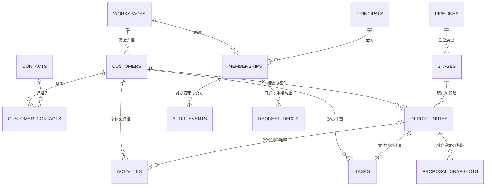
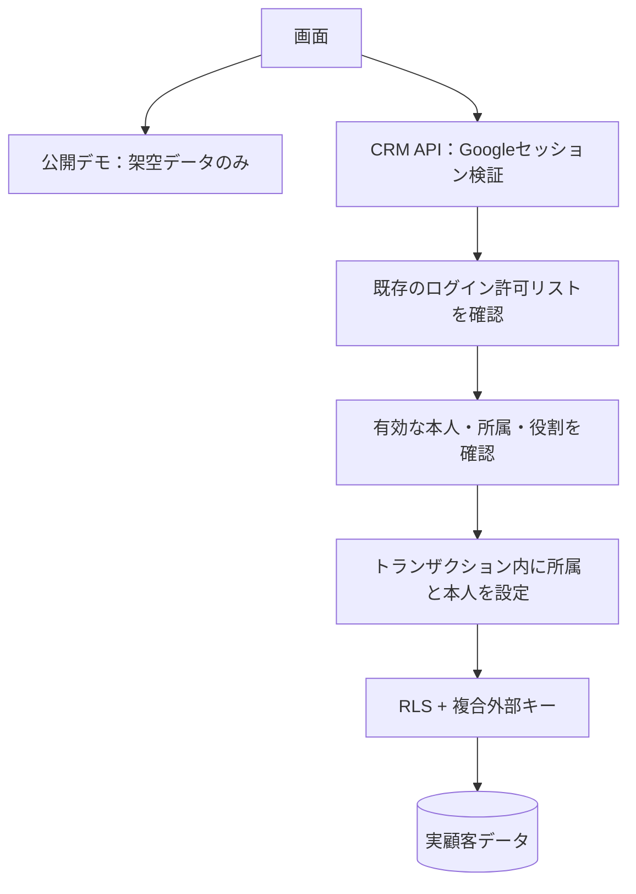
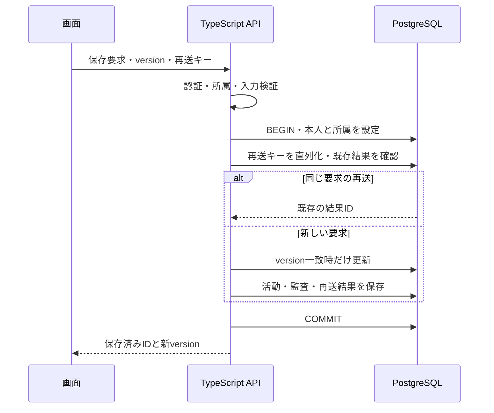

# Relay CRM データベース設計

2026-09-14 / 設計案 v1 / **本番未適用・CRM保存API未実装**

## 1. 方針

**顧客を恒久的な台帳とし、連絡先・複数案件・対応履歴・次の仕事・料金提案を紐づける。** PostgreSQLを引き続き使い、Vercel上のTypeScript APIを唯一の更新入口にする。既存のGoogle認証・LINE・カレンダーのテーブルを壊さず、新しい`relay_crm`スキーマへ業務データを分離する。

Salesforceのように蓄積・検索・引き継ぎができることを目的とし、最初から全機能を複製しない。初期リリースは「顧客台帳 → 案件 → 活動 → タスク → 保存した料金提案」。営業のステージは会社ごとの設定とし、施工工程などの業界条件を顧客テーブルに固定しない。

- **決定する設計**：顧客と案件の分離、所属先による隔離、Google subjectによる本人識別、変更履歴、楽観ロック、料金提案の版管理。
- **初期の仮定**：1社・15人程度、顧客10,000件・活動100万件までを設計評価の目安とする。実測・性能保証ではない。複数社への展開に備え、最初から`workspace_id`を持つ。
- **開始前に決める運用**：DBサービスと契約プラン、バックアップ目標、データ保持期間、最初の所属メンバー。個別案件を担当者だけに隠す権限が必要か。これらは設計を進める妨げにはせず、実データ投入前の決定事項として残す。

実行可能な定義案は[crm-draft.sql](database/crm-draft.sql)。`migrations/`の外に置いてあり、通常のマイグレーションでは適用されない。SQLは構造・制約・履歴保護を示す。RLSは有効だが許可ポリシーをまだ置かず、通常の実行ロールからは全行を拒否する。**このSQLだけで顧客保存が利用可能になるわけではない。**

## 2. 顧客を中心にした関係

図は主要関係。全ての業務テーブルを所属先で隔離し、担当者・記録者は同じ所属先のメンバーを参照する。

**例**：顧客「サンプル株式会社」に、窓口A・経理B、案件「初回導入」「追加導入」を登録する。窓口Aが別法人も担当する場合、同じ連絡先を別の顧客にも紐づけられる。個人客は`individual`、家族単位なら`household`として扱い、本人・配偶者等は関係で表す。商談が失注しても、顧客と過去の活動は残る。

## 3. テーブルの責務

| テーブル | 主な項目 | 残す情報・制約 |
|---|---|---|
| `workspaces` | `id`, `name`, `time_zone`, `archived_at` | データの所属先。部署ではなく隔離単位 |
| `principals` | `id`, `issuer`, `subject`, `verified_email`, `disabled_at` | ログインする本人。`issuer + subject`が一意。メール変更でも履歴上の本人は同じ |
| `memberships` | `workspace_id`, `principal_id`, `role`, `status` | 所属と権限。退職・停止時も行を残す |
| `customers` | `kind`, `display_name`, `status`, `owner_id`, `region`, `version` | 個人・法人・世帯の顧客台帳。未担当はNULL。氏名は一意にしない |
| `contacts` | `display_name`, `email`, `phone`, 検索用正規化値 | 実際に連絡する人。メール・電話は任意で、複数顧客で共有できる |
| `customer_contacts` | 顧客、連絡先、`relationship`, `is_primary` | 本人・担当窓口・経理等の関係。顧客ごとの主連絡先は最大1件 |
| `pipelines` | `name`, `archived_at` | 会社ごとの営業プロセス |
| `stages` | `pipeline_id`, `name`, `kind`, `position` | 段階と並び順。分類は`open / won / lost` |
| `opportunities` | 顧客、タイトル、段階、担当、見込額、見込成約日、`version` | 同じ顧客の複数案件。受注・失注は段階の分類から判定 |
| `activities` | 顧客、任意の案件、種別、内容、発生日時、記録日時、記録者、根拠 | 実際に起きたこと。訂正は`supersedes_id`で旧記録を参照した追記 |
| `tasks` | 顧客、任意の案件、担当、状態、期限、待ち相手、完了根拠 | これから行うこと。活動とは別管理 |
| `proposal_snapshots` | 案件、版番号、入力、総額、残債、計算版、出典、作成者 | 提案時の変更不能な試算。正式契約・請求とは別 |
| `audit_events` | 操作者、対象、操作、差分、`request_id`, 日時 | 台帳の変更記録。業務メモと分ける |
| `request_dedup` | 所属、操作者、操作、キー、要求ハッシュ、結果ID、有効期限 | 二重タップ・再送時に同じ保存を増やさない |

`id`はサーバーで生成するUUID、時刻は`timestamptz`。表示時だけ利用者のタイムゾーンへ変換する。日単位の期限は`date`、時間指定は`timestamptz`とし、タスクで両方を同時指定しない。日付期限の判定はworkspaceのタイムゾーンを使う。`time_zone`はAPIでIANA名として検証し、使用後の変更は期限の表示に影響する管理操作として記録する。

金額は初期版ではJPYの整数円を`bigint`で保存し、APIでは十進文字列を使う。未確定の見込額はNULL、0円と区別する。業務本文・顧客名を翻訳キーにせず原文を保持する。システムの状態コードは翻訳リソースで表示する。

## 4. 同じ会社・顧客・案件に属することを保証

- 業務行は`workspace_id`を必須とし、`UNIQUE(workspace_id, id)`を持つ。
- 外部キーはUUID単体でなく`(workspace_id, customer_id)`などの複合キーにする。別会社のUUIDを知っていても関連付けできない。
- 活動・タスク・提案は、指定案件が同じ所属先・同じ顧客であることを`(workspace_id, customer_id, opportunity_id)`で検証する。顧客だけの活動・タスクも許可する。
- 案件の段階は`(workspace_id, pipeline_id, stage_id)`で制約し、別プロセスの段階への誤更新を防ぐ。
- 担当者・記録者は同じ所属先のmembershipを参照する。停止済み担当へ新しい仕事を割り当てないことはAPIで判定する。既存履歴の参照は残す。
- 親の削除で顧客履歴を連鎖削除しない。通常操作はアーカイブで、復元できるようにする。

FKは「存在・所属」、APIは「有効な担当か・編集可能か・今の状態から変更できるか」を担う。DB制約だけで業務承認を代用しない。複合FKの採用は[PostgreSQLの制約仕様](https://www.postgresql.org/docs/current/ddl-constraints.html)に基づく。

## 5. 公開デモ・本人認証・所属権限の三層

| 権限 | 顧客・案件の参照 | 登録・更新・活動記録 | 所属メンバー・プロセス管理 |
|---|---|---|---|
| 未ログイン | 不可。公開デモだけ | 不可 | 不可 |
| `viewer` | 所属先の全件 | 不可 | 不可 |
| `editor` | 所属先の全件 | 可 | 不可 |
| `admin` | 所属先の全件 | 可 | 可 |

**初期版は所属先内で全件共有**。`owner_id`は担当であり、閲覧権限を意味しない。部署・チーム限定や個別共有が必要になったら、明示的な共有テーブルとポリシーを設計し直す。実データ投入前にこの共有範囲を確認する。

既存`ADMIN_GOOGLE_EMAILS`はシステム管理者の入口、workspaceの`admin`は業務データの管理者であり別の権限。システム管理者だからといって全社の顧客を自動で読めるようにはしない。管理者・メンバーの初期登録は管理用手順で明示的に行い、最初のGoogleログインを自動昇格させない。

### RLSの実装契約

1. 既存セッションの検証済み`subject`と固定したGoogle issuerから`principals`へ対応付ける。メールは変更可能な属性で、既存LINEのemail所有権を無断で変換しない。
2. リクエストのworkspaceは単なる選択値。サーバーで本人・有効なmembershipを確認してから、同じDBトランザクションで`set_config('relay.workspace_id', ..., true)`と本人IDを設定する。クライアントから役割は受け取らない。
3. `SELECT`は所属一致・有効なメンバー、書込はさらにeditor/admin。`USING`と`WITH CHECK`の両方を定義する。設定がない、停止済み、別所属なら拒否する。
4. membershipsの自己参照ポリシーによる再帰を避ける。本人のmembership照会と管理者による変更を分け、必要な限定関数は固定search_path・最小権限・PUBLICのEXECUTE剥奪・テストを必須とする。
5. 実行ロールはテーブル所有者・superuser・BYPASSRLSにしない。マイグレーション所有者と分離し、TRUNCATE・DDLを付与しない。履歴テーブルはSELECT/INSERTだけ。
6. workspace・principal自体の参照、membership管理、監査書込も専用ポリシーを必要とする。実装前はdraftの全拒否を維持する。

RLSはAPIの認証の代わりではない。所有者・BYPASSRLS等の例外があるため、実際の実行ロールで確認する。[PostgreSQL RLS](https://www.postgresql.org/docs/current/ddl-rowsecurity.html) / [Supabase RLS](https://supabase.com/docs/guides/database/postgres/row-level-security)

Neon/Supabaseどちらでも、現行`postgres`接続とトランザクションの中で処理する。接続プールを前提に、セッション単位のSETで別リクエストへ所属値を残さない。`relay_crm`をSupabaseの公開API対象スキーマへ追加せず、ブラウザー用の鍵やservice roleで直接CRUDさせない。

## 6. 保存・競合・監査を同時に扱う

可変の顧客・連絡先・案件・タスクは`version`を持つ。更新は`WHERE workspace_id = $1 AND id = $2 AND version = $3`を条件に、`version = version + 1, updated_at = now()`を同時更新する。0件なら権限/存在を確認した上で409を返し、画面の入力を保持して差分確認へ進める。存在確認で他社データの有無を漏らさず404へ統一する。

保存成功は業務行・監査・再送結果が**同じトランザクションでコミットされた時点**。監査保存に失敗したら業務更新も戻す。更新前後の差分はサーバーが作り、クライアントの監査情報を信用しない。audit_eventsは監査対象が後から削除されても残すため、対象IDに多態的な外部キーを設けない。この例外は監査と再送結果だけに限定する。

二重保存対策は`(workspace, actor, operation, key)`を一意にする。APIは正規化した入力のSHA-256と一致を確認し、同じキー・違う本文なら409。同時要求はトランザクションのadvisory lock等で同じキーを直列化してから検索・処理する。結果IDを返す再送にも現在の権限を再確認する。暫定の保持期間は7日、期限後の自動再試行を禁止し再取得を促す。掃除ジョブは別途実装する。

管理操作によるmembership停止とCRM更新の競合は、更新トランザクションがmembershipを`FOR SHARE`で確認し、停止側が行更新で直列化する。既にコミットした操作は取り消さず、停止が先に確定した新規更新は拒否する。

## 7. 活動・完了・提案は履歴として残す

- 活動の発生日時`occurred_at`と登録日時`recorded_at`を分離する。過去の電話を今日記録できる。
- 活動は追記式。訂正は同じ顧客・同じ案件の直前記録を`supersedes_id`で参照し、旧記録も辿れるようにする。SQLは同じ顧客・一つの後続を制約、同案件・過去記録の実在と最新性はAPIで確認する。読み取りでは訂正履歴を折りたたみ、二重に活動件数へ計上しない。
- タスクの完了は完了活動の作成とタスク更新を一体にする。SQLは完了日時・根拠の必須と同じ顧客を制約する。APIは活動種別`task_completion`・同じ案件・明示的完了操作を検証する。再開時は完了参照を外して状態を更新し、元の活動と監査は残す。
- パイプラインの段階分類`kind`は使用後に変更しない。変更が必要なら新段階を作り、案件の移動を個別監査する。表示名・並び替えはpipeline行のロックで直列化し、管理操作として記録する。
- 料金提案の保存前にサーバーで既存TypeScriptエンジンを再実行する。入力・出典・顧客の表示名・計算版・業界ルール版・作成者を固定する。ブラウザーが送った合計を採用しない。
- SQL案の提案は現行`fixed-cost-jpy/1.0.0`専用。金額範囲・分割期間・総額・残債の整合もCHECKで検証する。異なるルールを追加するときは版に応じた検証/スキーマ移行を行い、既存制約を単に緩めない。
- 提案の`revision`は案件をロックして採番し、同時保存の番号衝突を避ける。新しい価格表でも旧提案の金額は変わらない。提案の表示・送信・顧客の合意は別イベントであり、保存を送信済みや受注済みと扱わない。

`customer_snapshot`は提示に必要な表示名だけ、`source_snapshot`は出典種類・日付・資料参照・費用範囲確認・スキーマ版に限定する。JSONの内部構造はTypeScript/Zodで厳格に検証し、不要な個人情報や書類全文を入れない。SQL案はobjectであることだけを検証する。

## 8. 検索・重複・入力負荷

新規顧客の最低入力は表示名と種別。担当者は操作中の本人を初期候補、その他は未確認のNULLで開始する。電話やメールがない顧客も残せる。既存顧客の選択から案件を作成し、顧客名や連絡先の再入力を減らす。

氏名・共有メール・家族の電話番号は重複し得るため、全体でUNIQUEにしない。メール/電話は原文と検索用正規化値を分離し、電話の国番号を不明なまま推測しない。Gmailのドットや`+suffix`を勝手に除去しない。同一候補を警告するが、自動統合しない。

初期版は顧客名の部分一致、メール/電話の正規化完全一致、担当・状態のフィルター。件数増加時は実測して`pg_trgm`等の検索索引を導入する。数万件を仮定しただけで全文検索サービスを追加しない。

顧客・活動の一覧は`(updated_at, id)`または`(occurred_at, id)`のカーソル方式、50件/ページを初期値とする。検索と件数集計にもworkspace条件を付ける。タスクの期限・担当、顧客別の活動、段階別案件の索引をSQL案に含める。索引の効果は実データに近い合成データでEXPLAIN確認後に判断する。

重複統合は第2段階。統合先・元顧客・判断者・項目選択を記録する専用モデルを追加する。初期段階では履歴の付替えや片方の削除で擬似統合しない。

## 9. APIと画面への接続案

全て新設予定。公開デモ用の既存ルートに実顧客データを混ぜない。

| API案 | 主な契約 |
|---|---|
| `GET /api/crm/workspaces` | 本人が有効に所属する先だけ返す |
| `GET/POST /api/crm/customers` | workspace選択を認可して一覧/作成。作成は再送キー必須 |
| `GET/PATCH /api/crm/customers/:id` | 台帳・更新。PATCHはversion必須 |
| `POST /api/crm/customers/:id/archive` | 関連する未完了タスク等を確認し、残件があれば409。担当移管/取消を明示操作 |
| `POST /api/crm/contacts` | 連絡先作成。顧客との関係も同一トランザクションで保存 |
| `GET/POST /api/crm/opportunities` | 既存顧客とプロセスを指定。更新はPATCH＋version |
| `GET/POST /api/crm/activities` | 顧客/案件ごとの時系列。訂正は新規追記 |
| `GET/POST /api/crm/tasks` | 担当別・期限別の仕事。更新/完了は専用操作とversion |
| `POST /api/crm/opportunities/:id/proposals` | 出典と確認済み入力をサーバー再計算し、新しい版を保存 |
| `GET /api/crm/proposals/:id` | 現在の所属権限で保存済み提案を取得 |

画面は公開デモ/CRMを明示的なモードで分ける。認証成功時に端末のデモを自動でDBへ移さない。CRM通信失敗をデモやlocalStorageへの保存成功に置き換えない。未保存入力は画面内に保持し、再認証・再取得後に競合確認する。ログアウト・主体変更時は顧客情報と取得キャッシュを破棄する。

## 10. 既存連携との関係と後続拡張

`relay_private`のセッション、LINE通知先、カレンダー接続、MCPキーは既存のまま維持する。初期CRMはそれらを顧客データとして複製しない。LINEの通知先は社内利用者の個人/グループ連携であり、顧客の連絡先ではない。

第2段階で日程と案件のリンク、通知のOutbox、文書メタデータと非公開オブジェクトストレージ、同意・連絡拒否、重複統合、外部IDによる取込重複排除を追加する。自動取込は出典・候補・人の承認を別テーブルにし、既存顧客を推測だけで更新しない。

第3段階でチーム限定共有、型付きカスタム項目、複数通貨、複数の金額ルール、集計を検討する。現段階でEAVや巨大な顧客JSON、イベントソーシング全面導入はしない。通常列で検索・制約を保ち、JSONは変更不能な出典スナップショット等に限定する。

## 11. 保持・削除・バックアップ

アーカイブは物理削除ではない。実運用前に個人情報・活動・提案・監査それぞれの保持期間を決め、機密内容をログ・監査へ丸ごと複製しない。メール/電話の変更監査は変更項目と必要最小限の差分に絞る。

削除要求や契約終了時の消去は別の管理手順。参照関係、提案内の顧客名、訂正元の履歴、外部ファイル、バックアップの保存期間も対象にする。追記式トリガーの例外を通常APIへ作らず、承認・作業記録付きの専用メンテナンスで消去/匿名化する。監査ログもDB所有者による改ざんを防ぐ保証ではない。高い保証が必要なら別保存先へ監査を転送する。

提案する運用目標はRPO 24時間以内・RTO 4時間以内。サービス/プランの機能と費用を確認して確定し、暗号化バックアップ・定期復元訓練で測定する。無料枠やDBサービス名だけで復旧保証を判断しない。バックアップの復元後に、削除対象の再消去と外部通知の再送防止も確認する。

## 12. 実装順と受入条件

1. **所属と認証境界**：実行ロール・RLS・本人対応付け・初期workspaceとmembershipを実装。別所属/未所属/停止済み/閲覧者の拒否を実DBで確認。
2. **顧客台帳**：顧客・連絡先CRUD、アーカイブ、検索、楽観ロック、監査、再送制御。公開デモとの分離をE2Eで確認。
3. **案件と対応**：パイプライン、案件、活動、タスク。担当変更や退職後も過去履歴が読めること、完了に明示根拠が必要なことを確認。
4. **料金提案の永続化**：サーバー再計算・版管理・保存済み提示。500通りの既存計算検証をDBへの往復にも適用し、価格変更後も旧版を再現。
5. **本番の利用開始**：外部設定、バックアップ復元、実端末の確認、招待した利用者による受入。以後に外部連携/自動化を拡張。

SQL案は隔離PGliteで既存マイグレーションとの併存、複合FK、同じ顧客/案件の制約、履歴の追記制約、完了根拠、提案金額の整合、全拒否RLSを検証する。これは本番RLS・API・保存画面を検証した証拠ではない。

再検証：リポジトリで依存関係を導入し、`node docs/database/verify-crm.mjs`を実行する。本番URL・資格情報は使わない。今後`migrations/003_...sql`へ昇格する際は、許可ポリシー・限定GRANT・監査保存を含めてレビューし、通常CIへテストを統合する。
