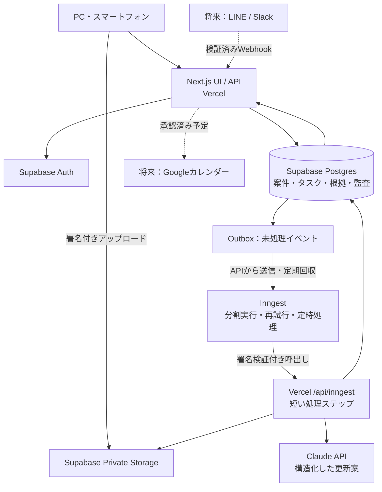

# Relay — 案件進行エージェント設計 v0.1

作成日：2026-09-11 / 状態：実装前の設計（開発要件は DEVELOPMENT.md を優先） / 対象：社内向け案件進行・引き継ぎエージェント

## 1. 作るもの

**業務の会話から顧客ごとの経緯を整理し、「次に誰が何をすれば進むか」を示すWebアプリ。**

朝、担当者は「今日の対応」を見る。案件を開くと、状況・次の対応・期限が分かり、元の発言は必要なときに開ける。電話で進んだ仕事は連絡方法と結果を選んで記録する。補足の入力は任意。管理者は担当不明・期日接近・情報の食い違いだけを確認する。

本番は **Next.jsをVercelに配置し、Supabaseにデータを保存、Inngestで非同期処理、Claude APIで情報を抽出**する。UI/APIのホスティング先はVercelで、DB・ジョブ管理・AIは外部サービスを使用する。

今回の成果物は本設計書と `../prototype/index.html` の操作サンプル。サンプルは架空データのみを使い、ログイン、AI、実データ取込、外部送信は接続していない。画面操作はブラウザーのメモリー内で動作し、再読込で初期状態に戻る。

## 2. 解決する課題

Relayは、営業を入口に、事務・運用・顧客サポートでも利用できる業務基盤を目指す。会話や活動から情報を整理し、手入力を減らして次の行動を明確にする。

| 一般的な業務課題 | 設計への反映 |
|---|---|
| 情報が会話・メール・予定表に分散する | 案件台帳へ根拠付きでひも付ける |
| 受付と承認の認識が食い違う | 状態を段階別に管理する |
| 担当者と返事待ちの相手が分からない | 社内担当・待ち相手・次の対応を別管理する |
| 日程未定の案件が埋もれる | 予定と次回連絡期限を分ける |
| 日程変更時に確認が引き継がれてしまう | 予定の改訂ごとに合意を記録する |

初期シナリオは訪問・契約・施工の引き継ぎを例にするが、業種固有の工程はテンプレートとして扱う。将来は案件種別ごとに段階・必要な合意・確認項目を設定できるようにする。

## 3. 前提と初期範囲

設計上の仮定：1社、管理者1〜2名、営業・事務合わせて5〜15名、同時進行案件300件以内、テキスト投稿1日500件以内、日本時間で運用。これらは見積もり用の仮定で、実測値ではない。

### 最初のリリースで実装

- 招待制ログイン。管理者・編集者・閲覧者の3権限。
- LINE書き出しTXT取込、会話の貼り付け、案件への電話メモ入力。
- 案件台帳、担当者、タスク、期限、待ち状態、予定、時系列の管理。
- AIによる更新案作成、根拠表示、差分確認、承認・修正・却下。
- 期限・依存関係に基づくアプリ内の注意表示と朝夕の一覧。
- 取込状況・失敗・未判定メッセージの表示。案件CSV出力。

### 続けて実装する連携

1. LINE公式アカウントによる参加後の新規メッセージ受信、またはSlackの許可済みチャンネル受信。
2. 承認済み予定のGoogleカレンダー連携と、外部で編集されたときの競合確認。
3. 許可した社内宛先への通知。外部の顧客・銀行・工事会社向けには文案作成から開始。

ローンの試算、補助金の適格判定、営業評価、日報集計はこの初期版には含めない。ローンや補助金の案件でも「書類回収や確認の進行」は管理する。

## 4. 画面設計

最新の見た目・寸法・状態・共通部品の基準は [デザインガイド](DESIGN_GUIDELINES.md) を参照する。トークンを見た目の値の正本とし、生成されたサンプルHTMLやCSSを直接編集しない。

PCでは左ナビゲーションと中央一覧を基本とし、案件詳細は情報量に応じてサイドパネルまたは専用ページを使う。現在のサンプルは案件詳細を専用画面とし、元の発言と引き継ぎ文はダイアログで表示する。スマートフォンでは一列カードと全画面詳細。「本日」「期日未設定」「完了確認が必要」などの文字とアイコン・線種で状態を表す。基礎色は墨黒・白・青の3色に限定する。

| 画面 | 主な情報 | できる操作 |
|---|---|---|
| 今日の対応 | 今日が期限、対応期限超過、予定接近、担当不明。取得済み情報の範囲と最終取込時刻 | 担当者絞込、案件を開く、対応メモを残す |
| 案件一覧 | 顧客、エリア、進行段階、次の対応、担当者、待ち相手、期限 | 検索、絞込、追加、詳細確認 |
| 案件詳細 | 要約、並行中タスク、依存関係、予定、会話の経緯、根拠、修正履歴 | 担当変更、期限設定、電話報告、タスク完了・再開、引き継ぎ文作成 |
| 更新案の確認 | AIが作った変更前後、理由、根拠、候補案件、曖昧な項目 | 一件承認、編集して承認、却下、別案件にひも付け |
| 情報を取り込む | TXT / 貼り付け、会話グループ、取得期間、取込基準日、重複件数、保留件数 | 取込、失敗部分の再実行、取込取消 |
| 管理設定 | 招待、権限、情報源、通知時刻、休日、注意表示ルール、費用上限 | 管理者のみ変更 |

案件一覧の「次の対応」は最優先タスクの要約。複数担当が並行作業している場合は「ほか2件」を表示し、一人だけが全案件のボールを持つと誤解させない。

### 代表操作

**会話 → 更新**：TXT選択 → 会話グループ指定 → 取込範囲確認 → 非同期解析 → 更新案の確認 → 承認 → 案件台帳へ反映。

**電話 → 記録**：案件を開く → 連絡方法「電話」、結果「相手が了承」、保存方法「記録のみ」を選択 → 保存。必要な日付や相手の特定は任意の補足へ入力する。この選択だけで予定確定やタスク完了にしない。本番の予定更新は具体的な根拠を伴う更新案で確認・承認する。サンプルでは記録保存までを実装し、記録からのAI提案は未接続。

**引き継ぎ**：案件を開く → 「引き継ぎを作成」→ 最新状況・残タスク・担当・期限・未確認事項・参照先を生成 → コピー。コピーしただけでは送信済み・完了にしない。

## 5. 案件とタスクの考え方

### 案件の段階

`見込み → 商談調整 → 商談中 → 契約後対応 → 工事調整 → 施工 → アフター対応 → 完了`

保留・キャンセルは別の `lifecycle_status` に保持。審査、書類回収、現地調査、発注は並行するため、単一の段階に押し込めず案件内のトラックとして管理する。段階変更は更新案で確認し、再工事が必要なら再開履歴を残す。

### タスクの状態

`未着手 / 対応中 / 相手待ち / 完了確認待ち / 完了 / 取消`

- 担当者は社内で追跡する人。相手待ちの場合も社内担当を消さない。
- 待ち相手は顧客・銀行・施工会社・社内担当など。回答期限と次回確認日は別項目。
- 「承知しました」は受領の記録。タスク完了ではない。
- 「連絡します」は予定。「連絡しました」は行為の報告。ただし、日程の合意まで取れたとは限らない。
- タスク完了には本人の報告または具体的な完了発言への参照を持つ。本人報告は「本人報告済み」と表示し、外部検証済みとは表示しない。
- アプリが見ていない電話・メールがあり得るため、記録不足は「完了確認が必要」と表示する。
- 「催促文の作成」「催促の送信」「相手の回答受領」を別々に扱う。

### 予定の扱い

予定には候補・顧客了承・施工側了承・確定・取消を持つ。必要な合意者の集合は予定種別ごとに定義する。顧客了承のみでは工事確定にしない。

リスケ時は `appointment.revision` を増やす。前確認や各社了承は revision にひも付くため、古い予定への了承を新予定に流用しない。顧客だけの変更で施工側の合意が残ってしまうことも防ぐ。

## 6. AI処理と更新ルール

### 処理の流れ

1. **受領・整形**：決定的なパーサーで日付、送信時刻、送信者、複数行本文、原文行番号を抽出。参加通知や定型リマインダーは分類し、必要なものだけ解析へ送る。
2. **マスキング**：ログイン情報・共有パスワード・トークン等を隔離。不要な電話番号、金融識別番号等をモデル入力から除外。書類の中身は初期版では解析しない。
3. **案件候補の検索**：確認済みの氏名表記・読み・エリア・案件番号で候補を引く。同姓や「こちら」「あの件」だけで自動統合しない。
4. **事実抽出**：会話の前後、関連案件の確定済み状態、未完了タスクをモデルに渡す。メッセージ境界で分割し、前後文脈を重ねる。重なった部分は提案IDで重複排除。
5. **検証**：出力スキーマ、根拠の存在と引用一致、日付、IDの所属、状態遷移、矛盾をサーバーで検証。文章が整っていても事実の正しさを保証しない。
6. **更新案保存**：変更前後、理由、必要確認、根拠、案件の版を保存。初期版は案件状態・担当・期限・完了を人が承認する。
7. **反映**：承認APIが版を確認し、DBトランザクションでタスク・案件履歴・監査記録を更新する。
8. **注意表示**：反映済みデータへ日付・担当・依存関係のルールを適用する。期限判定を毎回LLMに任せない。

自動で行うのは取込・重複除外・更新案作成・確定済みデータの期限判定。顧客統合、確定事項変更、対外連絡は確認できる操作として用意する。確認待ち案件は明示し、未承認の変更を確定状態や通知へ混ぜない。

### AIの出力契約（例）

```json
{
  "case_candidates": [{"case_id": "case_demo_01", "reason": "確認済みの顧客表記と一致"}],
  "observations": [{
    "kind": "customer_agreed",
    "occurred_at": "2026-09-11T05:20:00Z",
    "evidence": [{"message_id": "msg_demo_42", "start": 0, "end": 24}],
    "certainty": "explicit"
  }],
  "proposed_changes": [{
    "operation": "create_task",
    "payload": {
      "title": "工事会社へ現調日の確定連絡",
      "owner_member_id": null,
      "status": "todo",
      "due_at": null,
      "due_kind": "unset",
      "waiting_party_id": null
    },
    "evidence_message_ids": ["msg_demo_42"],
    "needs_confirmation": ["担当者", "対応期限"]
  }],
  "questions": ["工事会社への連絡担当者は誰ですか？"]
}
```

上記ID・日付・文字位置はスキーマ説明用の例。モデルに任意SQL・送信ツール・URL取得権限を与えない。本文中の「システム指示を優先」等は分析対象として扱い、アプリへの指示として実行しない。

### 曖昧さ・誤りへの対応

| 入力例 | 動作 |
|---|---|
| 「明日連絡する」 | 投稿日時とAsia/Tokyoから候補日を算出。取込実行日から計算しない |
| 日付と曜日が不一致／「8.60」 | 自動補正せず確認へ。原文を残す |
| 「金曜まで」「月末」 | 基準日と算出根拠を保存。文脈上複数解釈なら保留 |
| 引用・転送内の「明日」 | 引用元の日付が不明なら確定させない |
| 「たぶん通る」「通過予定」 | 見込みとして記録。審査通過へ変更しない |
| 顧客名不明・同姓 | 未ひも付け受信箱へ。候補を表示して選択してもらう |
| 複数案件を一投稿で報告 | 顧客ごとの根拠範囲を分割。タスクを横断流用しない |
| 同じ情報をLINEとSlackで受信 | 別原文のまま同じ事実の補強候補へ。二重タスクにしない |
| 新しい書き出しで古い投稿が再登場 | 投稿日時順に処理。現在状態を過去状態で上書きしない |
| 人が修正した担当者とAI抽出が競合 | 人の修正を保持し、食い違いとして表示 |
| 「画像」「PDF名」しかない | 添付内容不明と表示。回収済み・内容確認済みと推測しない |

### 過去ログの初回取込

「当時の状態を再現」と「現在の運用へ引き継ぐ」を分ける。全期間を時系列処理して最終状態候補を作り、過去タスクの通知は停止する。担当者が現状を確認して対象案件だけ有効化する。運用開始日以降のタスクでも、取込済み情報の最終日時を常に表示する。

TXTだけでは原本削除・送信取消対象を完全には特定できない。取消通知に対応する原文が不明な場合は削除を推測せず確認へ回す。

## 7. 優先順位と通知

### 初期ルール（管理者が調整）

1. **最優先**：確認済みの対応期限を超過／翌営業日の予定に必要な合意が不足。
2. **本日対応**：対応期限または次回確認日が今日。
3. **準備が必要**：3日以内の予定に対する前提タスクが未完了。
4. **確認が必要**：担当・期限が不明、回答待ちが3営業日を超過、根拠同士が矛盾。

無応答3営業日は設計上の初期値で、契約上の期限ではない。「違反」と表現しない。営業日カレンダーは管理者設定とし、初期は週末・祝日・各社休日を確認して登録する。

期限は `due_kind = explicit / human_set / suggested / unset` で分ける。AIの提案日は承認まで督促に使わない。日付だけなら `due_date`、時刻までなら `due_at` を使い、架空の時刻を補わない。

朝9:00 JSTは今日の一覧、夕方17:30 JSTは明日に影響する項目をアプリ内に生成。各担当へ最大5件と残件数を表示する。変更なしの同じ注意を繰り返さず、状態変更・期限段階の変化・スヌーズ終了時に再表示。完了・取消案件は除外。

通知の重複キーは `(org, task, rule, local_date, notification_stage)`。ジョブ再実行でも同じ通知を増やさない。取込遅延は案件の遅延と区別し、「情報が更新されていません」と表示する。

## 8. Vercel向け構成



| 部分 | 採用 | 理由と制約 |
|---|---|---|
| UI/API | Next.js App Router + TypeScript、Node.js Runtime | 一つのリポジトリでVercelへ配置。バージョンは実装時に検証して固定 |
| データ・認証・ファイル | Supabase Postgres / Auth / Private Storage | 関係データと認証を集約。公開テーブルにRLSと適切な権限設定 |
| 非同期処理 | Inngest | 分割、再試行、定時実行。処理実体はVercel上で短いステップとして実行 |
| AI | Claude APIの構造化出力をアダプター越しに使用 | 既存業務のClaude活用と親和性。モデル名は環境変数で固定し、変更時に評価 |
| 検索 | 顧客別名の完全一致・正規化検索、必要に応じpg_trgm | 初期はベクトルDB不要。案件IDと根拠の正確な対応を重視 |
| 更新表示 | 取込実行中のみステータスをポーリング | 初期は常時WebSocketを持たない |

Vercel Functionsには実行時間・ペイロード上限があるため、HTTP要求内で全履歴を解析しない。ファイルはStorageへ直接送信し、APIはIDとメタデータを受け付ける。Vercelのローカルディスクを永続保存に使わない。[Vercel Functions制限](https://vercel.com/docs/functions/limitations)、[Supabase署名付きアップロード](https://supabase.com/docs/reference/javascript/file-buckets-createsigneduploadurl)

InngestはNext.js/Vercelへの配置とステップ処理をサポートする。各ステップはVercelの時間制限内に収め、ジョブ全体だけを再開可能にする。[Inngest Next.js](https://www.inngest.com/docs/getting-started/nextjs-quick-start)

業務用の本番ホスティングはVercel Proを想定する。Hobbyは個人・非商用向け。[Vercelプラン](https://vercel.com/pricing)

## 9. データモデル

全業務テーブルに `org_id, created_at, updated_at` を持たせる。日時はUTC、表示はAsia/Tokyo。関連する外部キーは `(org_id, id)` の複合参照で組織をまたぐひも付けを防ぐ。

| テーブル | 主な項目 |
|---|---|
| organizations / memberships | 組織、user_id、role、active |
| parties / party_aliases | 顧客・銀行・工事会社等、表示名、種別、読み、エリア、確認済み別名 |
| cases | customer_party_id、area、stage、lifecycle_status、owner_member_id、summary、version、activation_status |
| tasks | case_id、title、track、owner_member_id(nullable)、status、waiting_party_id、due_date、due_at、due_kind、next_check_date、completed_at、completion_report_id、version |
| task_dependencies | task_id、depends_on_task_id。循環を拒否 |
| appointments / appointment_agreements | case_id、type、candidate_at、revision、status、required_parties / revisionごとの合意者と根拠 |
| connectors / source_conversations | 種別、許可する外部ID、状態、最終受信時刻、取込済み期間 |
| imports / import_chunks | conversation_id、基準日、ファイルhash、storage_path、mode、進捗、失敗理由、cursor、parser_version |
| messages / message_occurrences | conversation_id、provider_message_id、sent_at、received_at、sender、redacted_body、取消状態 / import_id、原文行番号、重複候補 |
| observations / evidence_links | case_id、種別、値、occurred_at、根拠message_idと文字範囲、source_revision、invalidated_at |
| proposals | case_id、base_version、typed_changes、status、根拠、model_version、prompt_version、reviewer、reviewed_at |
| activity_reports / case_events | 人の対応メモ、更新前後、actor、発生日時、案件内の連番 |
| jobs / outbox / notifications | 再試行回数、最終エラー、dedupe_key、published_at / 宛先、既読、snooze_until |
| audit_logs / llm_usage | 操作対象ID、実行者、操作、時刻 / token使用量、モデル、遅延、推定費用 |

### 重要な制約と索引

- 外部イベント：`UNIQUE(connector_id, provider_event_id)`。同じイベントの再配信を吸収。
- 取込ファイル：`UNIQUE(org_id, conversation_id, sha256)`。同じファイルの再取込は既存結果を返す。
- TXTの個別投稿：外部message IDがないため、日時・送信者・本文・前後の並びで重複候補を照合。単純な本文hashだけで同時刻の同文投稿を削除しない。新旧書き出しを比較した際の発生回数と位置を保存する。
- 提案：`UNIQUE(org_id, chunk_id, extraction_version, proposal_fingerprint)`。抽出し直した別バージョンは既存案と差分確認。
- 更新系は `expected_version` を必須とし、競合は409。承認時はトランザクションと行ロックを使用。
- 一覧用索引：`tasks(org_id, owner_member_id, status, due_date)`、`messages(org_id, conversation_id, sent_at)`、`proposals(org_id, status, created_at)`。
- ケース、タスク、提案の更新は型付きAPI/RPCに集約。ブラウザーから重要列を直接書き換えられる権限を与えない。

## 10. API契約

`/api/inngest` と将来の外部Webhook以外はログイン必須。組織はサーバーが有効なmembershipから確定する。GETはページング必須。本文上限・レート制限・CSRF対策を設ける。

| API | 入力・出力の概要 |
|---|---|
| `POST /api/imports/upload-ticket` | file_name、size、conversation_id → import_id、署名付きアップロード先。TXT最大10MBは製品側の初期上限 |
| `POST /api/imports/:id/commit` | 既存import_id。実ファイルの型・サイズ・所有権を再検証 → 202 + job_id |
| `POST /api/imports/paste` | conversation_id、text、as_of、mode → 202 + import_id。本文256KBまで |
| `GET /api/imports/:id` | status、進捗、解析済み件数、保留、マスキング件数、error_code |
| `POST /api/imports/:id/retry` | 失敗chunkのみ再処理。idempotency key必須 |
| `GET /api/dashboard` | 担当者、基準日 → 対応一覧、情報取得範囲、最終取込時刻 |
| `GET /api/cases` | q、owner、stage、cursor → 案件一覧 |
| `GET /api/cases/:id` | 案件・未完了タスク・予定・時系列・根拠 |
| `POST /api/cases/:id/reports` | 本人対応メモ → reportと関連更新案 |
| `PATCH /api/tasks/:id` | expected_version、許可された変更、完了時はreport_id → 更新後version |
| `GET /api/proposals` | status、case_id、cursor → 更新案一覧 |
| `POST /api/proposals/:id/review` | approve / reject / amend、expected_version、typed_edits → 更新結果。競合なら409 |
| `POST /api/cases/:id/handoff` | jobを作成 → 202。完成後、根拠付き引き継ぎ文を取得 |
| `GET /api/cases/export` | 権限範囲のCSV。表計算ソフトの式として解釈される値を無害化 |
| `GET/POST/PUT /api/inngest` | Inngest SDKのserveハンドラー、署名鍵検証 |
| 将来：`POST /api/webhooks/line/:connectorId` | raw bodyの署名検証 → 永続受領 → 200。未登録groupIdは取込しない |

## 11. 非同期処理と障害復旧

ファイル受領とoutbox作成を一つのDBトランザクションにする。その後Inngestへ通知する。送信失敗でもoutboxが残り、Inngestの定期回収が未発行イベントを再送する。受信側の一意キーで二重処理を防ぐ。

ワーカーはorg/job権限と取込状態を再検証。会話単位の処理順序を守り、案件反映時には版管理を使う。初期設定では一つの取込内は順次解析し、別会話の解析のみ並列化する。

処理ステップは「パース」「数十投稿単位の抽出」「候補保存」「集約」に分割。LLMへの一回の文脈は最大約8,000入力トークンを初期目安とし、長文一投稿は段落分割して同じmessage_idに帰属させる。未処理部分を黙って切り捨てない。

一時的な429/5xx/ネットワーク障害は指数バックオフで最大4回再試行。スキーマ不正は一度だけ修復要求し、失敗時は要確認にする。上限超過・認証失敗・永続的な形式不正は自動再試行しない。

各ステップのタイムアウトは90秒を目安に設定し、実装時にAIモデルの遅延とVercel設定へ合わせる。進行中ジョブが切れた場合は最後にコミットしたchunkから再開。UIには処理済み・失敗・未処理の内訳を表示する。

情報源の一部が停止しても、既存案件の閲覧と本人報告は可能にする。取込待ちを「最新」と表示しない。DBバックアップと復元手順を本番運用前に確認する。

## 12. LINE・他ツール連携の現実的な入口

**初期版はTXTと貼り付けを正式な入口とする。** 自動連携なしでも、管理者が定期的に書き出しを取り込み、担当者が電話メモを追加できる。

自動連携ではLINE公式アカウントをグループへ参加させ、参加後のイベントを受信する設計にする。過去履歴を取得するAPIを前提にせず、過去分はTXTを使用する。LINE公式仕様では同時に参加できる公式アカウントはグループあたり1つ。既存Botがいる場合は、そのアカウントの種別と参加可否を実装前に確認する。参加できない場合はTXT運用またはSlack連携を先に行う。[LINEグループ仕様](https://developers.line.biz/en/docs/messaging-api/group-chats/)

Webhookは署名検証、event IDによる重複除外、発生時刻による順序復元を行う。取消イベントでは対象本文と引用を除去し、そこだけを根拠にした提案・要約を無効化して再評価する。編集イベントでは新revisionを作り、古い根拠の提案を再確認へ戻す。ジョブログに本文を残さない。[LINE Webhook](https://developers.line.biz/en/docs/messaging-api/receiving-messages/)

Googleカレンダーは第二段階。案件台帳を進捗の正本とし、予定は外部event ID・etag・最終同期値を保存する。外部変更を見つけたら差分提案にし、双方向で無条件上書きしない。現在のカレンダーを置き換える場合も段階的に対象予定を選ぶ。

## 13. 認証・情報の保護

管理者が招待したメールアドレスのみ参加可能。自己登録による組織作成は初期版では無効。全業務データを組織境界で分離し、管理者はメンバーと設定、編集者は案件とタスク、閲覧者は閲覧のみ扱える。

Supabaseの公開スキーマはRLSとGRANTを併用し、匿名アクセスを拒否する。重要更新は権限を検証するAPIに限定。service roleはバックグラウンド専用でサーバーのみ保持し、各ジョブでもorg_idと対象IDの所属を再検証する。[Supabase RLS](https://supabase.com/docs/guides/database/postgres/row-level-security)

取り込む会話に機密情報が含まれる可能性を考慮し、原文ファイルは隔離した非公開Storageに置く。モデル・通常画面・アプリログにはマスキング済み本文だけを使用する。管理者だけが必要時に原文へアクセスでき、その操作も記録する。

初期保持方針案：隔離原本は取込から30日後に削除、マスキング済み会話と案件履歴は案件終了から1年、操作監査は1年。管理者が運用要件に合わせて設定する。削除時には提案内引用・要約・検索索引まで追跡し、バックアップ復元時にも削除記録を再適用する。LINE取消本文の削除はこの通常保持期限を待たず行う。

API秘密鍵を `NEXT_PUBLIC_*` にしない。組織別データを共有キャッシュに置かない。Previewは架空データと別DB/別鍵を使い、本番顧客情報を載せない。LLM提供先に渡るデータ範囲と保持設定は本番接続時に明示する。

## 14. 配置・環境変数・費用

### 実装時の想定構成

```text
app/
  (auth)/login/
  (app)/today/ cases/ reviews/ imports/ settings/
  api/imports/ cases/ tasks/ proposals/ inngest/
components/ cases/ tasks/ evidence/ proposals/
lib/ auth/ db/ parsers/ redaction/ ai/ rules/
inngest/functions/ import-history.ts extract-chunk.ts refresh-alerts.ts
supabase/migrations/
tests/ fixtures/ unit/ integration/ e2e/
```

環境変数：`NEXT_PUBLIC_SUPABASE_URL`、`NEXT_PUBLIC_SUPABASE_PUBLISHABLE_KEY`、`SUPABASE_SERVICE_ROLE_KEY`、`ANTHROPIC_API_KEY`、`AI_MODEL`、`INNGEST_EVENT_KEY`、`INNGEST_SIGNING_KEY`、`APP_ORIGIN`。将来の接続シークレットは接続先ごとにサーバー側で管理。

本番手順：専用Supabase作成 → migration/RLS適用 → 招待管理者登録 → VercelへNext.js配置 → 環境変数設定 → Inngest接続 → 架空データで受入 → 対象10案件で運用開始。依存ライブラリはlockfileで固定し、DB変更は追加互換のmigrationから行う。

本番とPreviewはDB・Storage・AI鍵・イベント環境を分離。Previewへのイベント配信と社外送信を無効化。FunctionsとDBは利用可能な近いリージョンを選択するが、全サービスのデータが国内だけに滞留するとは保証しない。

費用は **Vercelの契約＋Supabaseの契約/容量＋Inngestの実行量＋LLM入出力トークン＋将来の通知費**。モデル価格・必要席数・実行回数が未確定なので固定の月額は提示しない。モデルを使わない期限集計と差分解析で費用を抑える。

初期運用では7日間、案件あたり解析費用・一投稿あたりトークン・ジョブ件数を記録して月額換算。管理者設定の月次AI予算に対して80%で通知、100%で新規AI解析を保留する。閲覧・本人記録は継続。これは予算管理上の製品方針であり、クラウド請求全体を厳密に遮断する仕組みではない。

## 15. 受入条件

| ケース | 合格条件 |
|---|---|
| 同じTXTを2回取込 | 案件・タスク・提案が増殖しない |
| 一部重なるTXT、同時刻同文の別投稿 | 重複と実在する反復を区別でき、曖昧分は確認へ |
| 同姓の顧客2名 | 自動統合しない |
| 「承知しました」 | タスクが完了しない |
| 受付済み／審査通過予定 | 審査通過に変更しない |
| 日程変更 | 古いrevisionの前確認・合意を引き継がない |
| 顧客のみ日程了承 | 施工側への連絡タスクが残る |
| 一投稿に複数案件 | 根拠と変更が正しい案件へ分離される |
| 日付・曜日不一致 | 確定予定へ自動反映しない |
| 手動修正直後に古い案を承認 | 409で差分の再確認になる |
| AI停止・再配信 | 既存データ閲覧可能。再実行で二重更新しない |
| 取込原文に指示文・秘密情報 | 指示を実行せず、秘密情報をAIやログへ送らない |
| 別組織・閲覧者による更新 | DB/API双方で拒否 |
| 過去ログの初回取込 | 現状確認前に過去期限の通知を大量発行しない |
| 将来のLINE取消・編集 | 古い本文・引用・派生要約の利用が停止し、再確認対象が分かる |

抽出精度は担当者がラベル付けした匿名化50例以上で評価する。重大項目（顧客、確定日、担当者、完了状態）の誤確定ゼロを初期受入目標とし、AIだけの完了判定は導入しない。曖昧なものを保留できる率も評価する。モデル・プロンプト変更時は同じ評価を再実行する。

## 16. 実装の順序と再検討条件

1. **案件台帳を動かす**：認証、手入力、タスク、履歴、根拠表示。AIなしでも電話メモと引き継ぎが成立することを確認。
2. **TXT解析を接続**：パーサー、マスキング、更新案、承認、版管理、再試行を実装。
3. **注意表示を追加**：期限ルール、営業日、担当不明、取込遅延、朝夕一覧。
4. **10案件で試行**：導入前後の進捗確認時間、期限超過、誤提案、確認待ち滞留を比較。
5. **新規メッセージ受信を追加**：LINEのグループ条件またはSlack権限を確認して一つずつ接続。
6. **カレンダー・社内通知**：変更履歴・重複抑制・競合処理を確認して接続。

利用者に確認待ちが溜まる場合は、顧客照合と提案単位を先に改善する。300案件超で一覧検索が遅くなれば索引・ページングを計測する。多数組織へ展開する場合は担当範囲の詳細権限・組織ごとのジョブ上限・課金分離を再設計する。文書全文の検索需要が出た時点でOCRとベクトル検索を検討する。

## 17. 技術の確認元

2026-09-11参照。下記は採用技術の仕様確認に使用し、製品の業務ルール・画面・優先順位は本設計で提案したもの。

- [Vercel Functions制限](https://vercel.com/docs/functions/limitations)
- [Vercelプラン](https://vercel.com/pricing)
- [Inngest Next.js](https://www.inngest.com/docs/getting-started/nextjs-quick-start)
- [Supabase RLS](https://supabase.com/docs/guides/database/postgres/row-level-security)
- [Supabase署名付きアップロード](https://supabase.com/docs/reference/javascript/file-buckets-createsigneduploadurl)
- [Claude構造化出力](https://platform.claude.com/docs/en/build-with-claude/structured-outputs)
- [LINEグループ仕様](https://developers.line.biz/en/docs/messaging-api/group-chats/)
- [LINE Webhook](https://developers.line.biz/en/docs/messaging-api/receiving-messages/)
